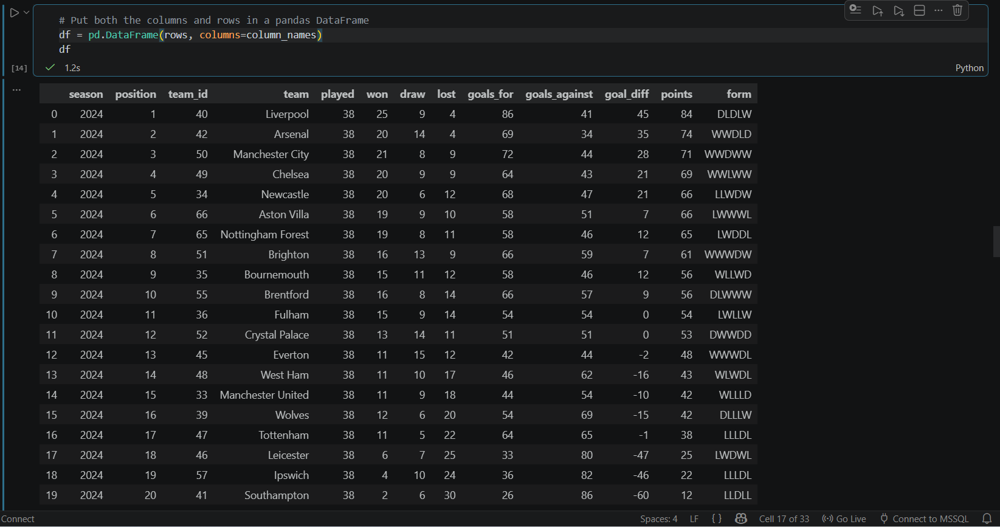
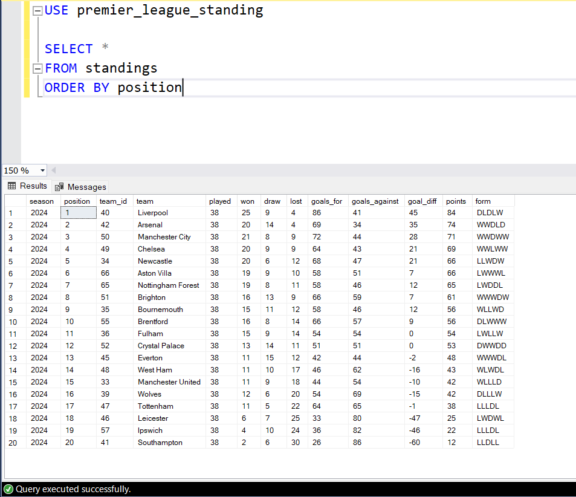
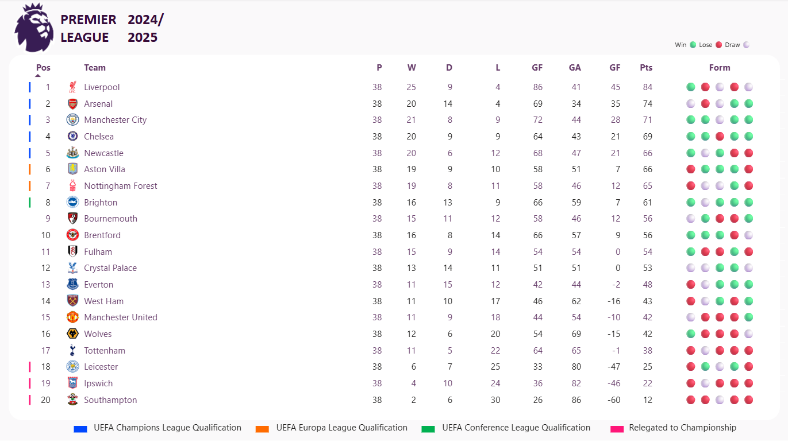

# Premier League Standings Data Pipeline (Python + SQL) 

## OVerview 
This project builds a simple data pipelie that retrieves English Premier League standings from an external API, processes the data using Python, and stores it in a Microsoft SQL server database for fast access and analytics using PowerBI. 

## Problem Statement 
On matchdays, users experience delays when trying to view updated league standings due to slow external websites. This project addresses that issue by creating a local, fast-access data pipeline that ensures timely and reliable standings data. 

## Objective
-  Provide near real-time league standings
-  Reduce latency in accessing standings
-  Enable structured data storage for analytics and reporting

## Tools & Technologies
-  Python
-  Microsoft SQL Server
-  Rest API(API-Football)

## Data Pipeline Breakdown
### 1. Extract
   - ### API Extraction

``` Python
# Imported Libraries

import os  
import json
import requests
import pandas as pd
import pyodbc as connector
from dotenv import load_dotenv

load_dotenv() # Gives the permission to load sensitive details in the .env file

API_KEY = os.getenv("API_KEY") # Get the API Key
API_HOST = os.getenv("API_HOST") # Get the APi Host 
SEASON = os.getenv("SEASON") # Specifies the season
LEAGUE_ID = os.getenv("LEAGUE_ID")
#print(API_KEY, "", API_HOST)

url = "https://v3.football.api-sports.io/standings"

headers = {
	"x-rapidapi-key": API_KEY,
	"x-rapidapi-host": API_HOST
}
querystring = {
     "league": LEAGUE_ID,
     "season": SEASON 
}

# load the response to another variable 
payload = response.json()

```
## 2. Transform
   - #### Parse JSON response || Clean and structure data using pandas
```python
standing_list = payload['response'][0]['league']['standings'][0]  # Navigate nested JSON to extract league standings list

rows = []  # Initialize container to store transformed records (each row = one team)
column_names = ['season', 'position', 'team_id', 'team', 'played', 'won', 'draw', 'lost', 'goals_for', 'goals_against', 'goal_diff', 'points', 'form' ] # Define target schema for the dataset

#Loop through the list and extract the needed fields.
for club in standing_list:
    season          = 2024
    position        = club['rank']
    team_id         = club['team']['id']
    team            = club['team']['name']
    played          = club['all']['played']
    won             = club['all']['win']
    draw            = club['all']['draw']
    lost            = club['all']['lose']
    goals_for       = club['all']['goals']['for']
    goals_against   = club['all']['goals']['against']
    goal_diff       = club['goalsDiff']
    points          = club['points']
    form            = club['form']

      # Create an immutable record (tuple) representing one row of structured data
      tuple_of_club_record = (season, position, team_id, team, played, won, draw, lost, goals_for,goals_against, goal_diff,       points, form)

      # Append the structured row to the rows collection for downstream processing
      rows.append(tuple_of_club_record)

# Put both the columns and rows in a pandas DataFrame
df = pd.DataFrame(rows, columns=column_names)

# Data Quality check 
if len(rows) !=20:
    raise ValueError("Data quality check failed: Expected 20 teams")
```
### Transformation Output



## 3. Load
   - ### Connect to SQL Server & Insert/Upsert cleaned into database

```python

import pyodbc  # ODBC driver interface for connecting Python to SQL Server

# Establish connection to SQL Server using Windows authentication
db_connection = pyodbc.connect(
    "DRIVER={ODBC Driver 17 for SQL Server};"
    "SERVER=gideon-oquongud\SQLEXPRESS;"
    "DATABASE=premier_league_standing;"
    "Trusted_Connection=yes;"
)

server_cursor = db_connection.cursor()  # Initialize cursor for executing SQL commands
)

# Validate target table existence before performing any load operation
sql_table = 'standings'

cursor.execute("""
        SELECT 1 
        FROM INFORMATION_SCHEMA.TABLES
        WHERE TABLE_NAME = ?
               """, (sql_table,))

if cursor.fetchone() is None:
    raise SystemExit(f"This table '{sql_table}' is NOT found...please create it...")
else: 
    print(f"[SUCCESS] - This table '{sql_table}' exist! Continue to the next phase!")

# Align DataFrame schema with target SQL table structure to prevent column mismatch issues
table_cols = ['season', 'position', 'team_id', 'team', 'played', 'won', 'draw', 'lost', 'goals_for', 'goals_against', 'goal_diff', 'points', 'form' ]

standings_df = df[table_cols]  # Subset DataFrame to only required columns in correct order

# Convert DataFrame rows into tuples for efficient bulk database operations
standings_records_tuples = standings_df.itertuples(index=False, name=None)

# Materialize iterator into list for batch execution
list_of_standings_records_tuples = list(standings_records_tuples)

# Define UPSERT (MERGE) logic: update existing records or insert new ones based on business key
merge_SQL = f"""
    MERGE INTO {sql_table} AS target
    USING (VALUES(?, ?, ?, ?, ?, ?, ?, ?, ?, ?, ?, ?, ?)) AS source
    (season, position, team_id, team, played, won, draw, lost, goals_for, goals_against, goal_diff, points, form)

    ON target.team_id = source.team_id AND target.season = source.season

    WHEN MATCHED THEN 
        UPDATE SET 
            position        = source.position,
            team            = source.team,
            played          = source.played, 
            won             = source.won,
            draw            = source.draw, 
            lost            = source.lost, 
            goals_for       = source.goals_for, 
            goals_against   = source.goals_against, 
            goal_diff       = source.goal_diff, 
            points          = source.points,
            form            = source.form
    WHEN NOT MATCHED THEN 
    INSERT (season, position, team_id, team, played, won, draw, lost,goals_for, goals_against, goal_diff, points, form)
    VALUES(source.season, source.position, source.team_id, source.team, source.played, source.won, source.draw, source.lost, source.goals_for, source.goals_against, source.goal_diff, source.points, source.form);
"""

# Execute batch UPSERT with transaction handling, rollback on failure, and guaranteed resource cleanup
try:
    cursor = db_connection.cursor()
    
    cursor.executemany(merge_SQL, list_of_standings_records_tuples)
    db_connection.commit()
    print(f"[SUCCESS] - Upsert attempted for {no_of_rows_uploaded_mssql} ")
except Exception as e:
    print(f"[ERROR] - Rolled back due to this....{e}")

    try:
        db_connection.rollback()
    except Exception:
        pass

finally:
    try:
        cursor.close()
    except Exception:
        pass
    try:
        db_connection.close()
    except Exception:
        pass

    print("All database connections now closed. \n\n Clean up completed.")
```
### 3. MSSQL Server final result output



### PowerBI 2024/2025 Premier League Standing Dashboard


## Data Model  
Fields Captured;
-  Season
-  Position
-  Team ID
-  Team ID
-  Matches Played
-  Wins / Draws / Losses
-  Goals For/Against
-  Goal Difference
-  Points
-  Recent Form

## Data Quality Checks
-  Ensure exactly 20 teams
-  No missing values
-  Correct data types (integers for numeric fields)

## Approach & Though Process 
- Broke down the problem into Extract, Transform, Load stages
- Focused on minimal viable pipeline first, then improved reliability
- Used environment variables to secure credentials
- Debugged issues iteratively (API response, environment setup, SQL connection)

## Key Learnings 
- API data extraction and handlign JSON
- Data cleaning and transformation with Python
- Connecting Python to SQL Server
- Writing efficient insert/upsert logic
- Debugging and troubleshooting environment issues
- Structuring projects for scalability

## Project Structure 
- test.ipynb
- .env
- .gitignore
- README.md

## Future improvements 
- Automate Pipeline (Scheduling)
- Add Dashboard (PowerBI)
- Improve error handling and logging

